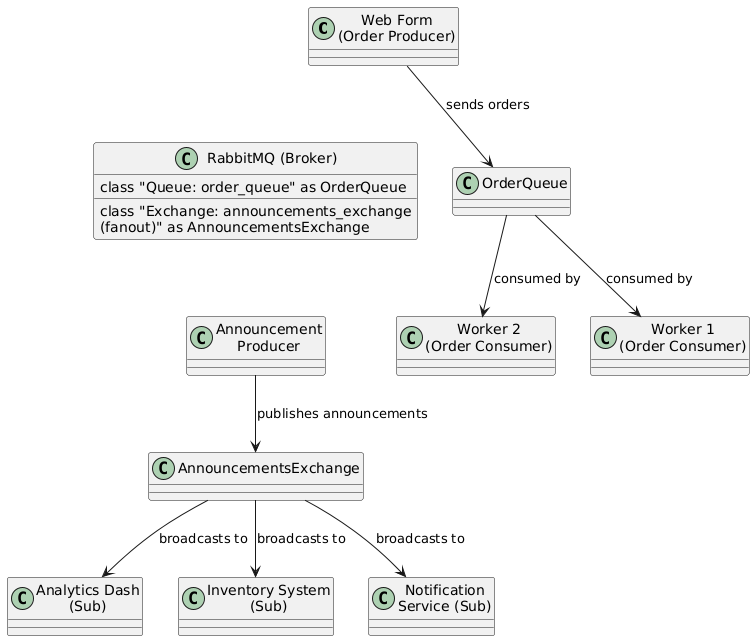

# E-Commerce Messaging System with RabbitMQ

This repository implements a simple messaging system for an e-commerce scenario using RabbitMQ. It demonstrates two key messaging patterns:
- **Point-to-Point (P to P)**: Orders are sent to a queue and processed by one consumer from a pool of workers.
- **Publish/Subscribe (Pub/Sub)**: Announcements are broadcast to multiple subscribers via a fanout exchange.

The system uses Node.js for scripting and JSON as the message format.

## Prerequisites

Before running the system, ensure you have the following installed:
- [Docker](https://www.docker.com/get-started) (to run RabbitMQ)
- [Node.js](https://nodejs.org/) (v14 used here)
- [npm](https://www.npmjs.com/) (comes with Node.js)

## Repository Structure

- `producer.js`: Sends orders to the `order_queue` (P to P producer).
- `consumer.js`: Listens to `order_queue` and processes orders (P to P consumer).
- `pub.js`: Publishes announcements to `announcements_exchange` (Pub/Sub producer).
- `sub.js`: Subscribes to `announcements_exchange` and receives announcements (Pub/Sub consumer).
- `package.json`: Defines dependencies (`amqplib` for RabbitMQ connectivity).
- `diagram.png`: Diagram of the messaging system architecture (created with Draw.io).

## Setup Instructions

### 1. Install Node.js Dependencies

Clone this repository and install the required Node.js package (`amqplib`):

```bash
git clone https://github.com/alexdieu/E-Commerce-Messaging-System-with-RabbitMQ/tree/main
cd E-Commerce-Messaging-System-with-RabbitMQ
npm install
```

### 2. Run RabbitMQ with Docker

Start a RabbitMQ instance with the management UI enabled:
```bash
docker run -d --name rabbitmq -p 5672:5672 -p 15672:15672 rabbitmq:3-management
```
- Port 5672: RabbitMQ AMQP port for communication.
- Port 15672: Management console (access at http://localhost:15672, default credentials: guest/guest).


Verify RabbitMQ is running:

- Open http://localhost:15672 in your browser.
- Optionally, create `order_queue` and `announcements_exchange` (fanout type) manually via the UI, though the scripts will auto-create them.

### 3. Run the Scripts

Open multiple terminal windows to simulate producers and consumers. Ensure you’re in the repository folder.
Point-to-Point (P to P) Model

- Start Consumers:
Run multiple consumer instances to simulate competing workers:
```bash
node consumer.js
```
Open additional terminals and run node consumer.js again (exemple : 2-3 instances).

- Send Orders:
Run the producer to send an order:
```bash
node producer.js
```
Repeat this command with different orders (edit the order data in producer.js if desired).

Expected Output:
Each consumer logs `Waiting for orders in order_queue`.
When producer.js runs, one consumer processes the order and logs it (exemple : `Received order: { orderId: 101, ... }`).

- Publish/Subscribe (Pub/Sub) Model
    **Start Subscribers**:
        Run multiple subscriber instances to simulate different services:
```bash
node sub.js
```
*Open additional terminals and run node sub.js again (exemple : 2-3 instances).*
        
- Send Announcements:

Run the publisher to broadcast an announcement:
```bash
node pub.js
```
*Edit pub.js to send different announcements if needed.*
    
Expected Output:
        Each subscriber logs "Waiting for announcements in queue: <random-queue-name>".`
        When pub.js runs, all subscribers log the same announcement (exemple : "Received announcement: { title: 'Flash Sale', ... }").

### 4. Stopping the System
Stop consumers/subscribers with Ctrl+C in their terminals.
Stop RabbitMQ:
```bash
docker stop rabbitmq
docker rm rabbitmq
```
### Troubleshooting
- Connection Errors: Ensure RabbitMQ is running (docker ps) and the URL (amqp://localhost) is correct.
- No Messages Received: Verify queue/exchange names match (order_queue, announcements_exchange) and consumers/subscribers are started before producers.
- Management UI Issues: Check http://localhost:15672 is accessible and credentials work.

### Data choice : json:

- **Simplicity**: JSON is lightweight, human-readable, and easy to parse in Node.js (using `JSON.parse` and `JSON.stringify`), which aligns with the implementation language.
- **Flexibility**: It supports structured data (e.g., nested objects for orders or announcements), suitable for both scenarios.
- **Interoperability**: Widely supported across systems, making it ideal for a web application interacting with RabbitMQ and potential future integrations.
- **Scenario Fit**:
  - **P to P**: Orders (e.g., `{ "orderId": 101, "customerName": "Pablo Arce", "items": ["Computer"] }`) are simple key-value structures.
  - **Pub/Sub**: Announcements (e.g., `{ "title": "Discount Sale !! ", "details": "50% off everything !!" }`) are similarly straightforward.
- **Comparison**: Compared to XML (more verbose) or EDI (too complex for this scope), JSON strikes the right balance for an e-commerce demo.

### Schematization of the system



Highlight both the Point-to-Point (P to P) and Publish/Subscribe (Pub/Sub) patterns:

- **Components**:
  - **Web Form (Order Producer)**: Sends customer orders to RabbitMQ.
  - **RabbitMQ (Broker)**: Central hub containing:
    - `order_queue`: A durable queue for P to P messaging.
    - `announcements_exchange`: A fanout exchange for Pub/Sub messaging.
  - **Worker 1 & Worker 2 (Order Consumers)**: Competing consumers that process orders from `order_queue`.
  - **Announcement Producer**: Publishes announcements to `announcements_exchange`.
  - **Notification Service, Inventory System, Analytics Dash (Subscribers)**: Services that receive announcements from the exchange.

- **Message Flows**:
  - **P to P Flow**: 
    - The `Web Form` sends orders to `order_queue`.
    - Orders are pulled from `order_queue` by either `Worker 1` or `Worker 2` (one consumer per message), demonstrating task distribution and load balancing.
  - **Pub/Sub Flow**: 
    - The `Announcement Producer` publishes messages to `announcements_exchange`.
    - The fanout exchange broadcasts these messages to all subscribers (`Notification Service`, `Inventory System`, `Analytics Dash`), ensuring each receives a copy.


### Notes
Messages are persistent `(durable: true, persistent: true)` to survive RabbitMQ restarts, though you’ll need to restart consumers too.
JSON is used as the data format for its simplicity and compatibility with Node.js.
